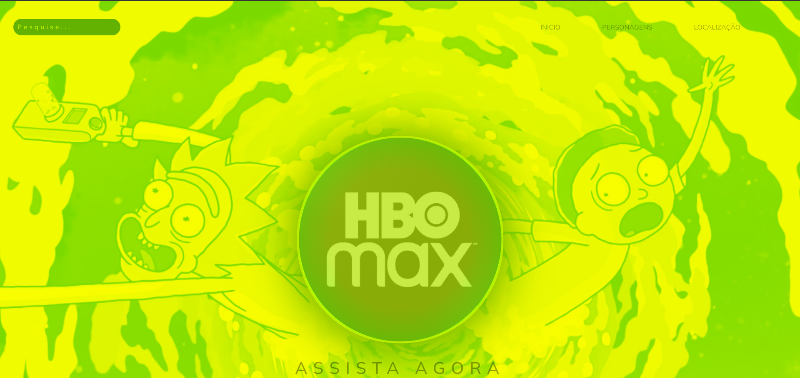

# API RICKY AND MORTY

|             DESKTOP             |
|:-----------------------------: |
 |  |

## [Clique aqui](https://api-ricky-and-morty-nv2n.vercel.app) para acessar o site

   
<h1>SUMÁRIO</h1>

- [TO DO LIST](#to-do-list)
- [TECNOLOGIAS APLICADAS](#tecnologias-aplicadas)
- [FERRAMENTAS](#ferramentas)
- [CONCEITOS APLICADOS](#conceitos-aplicados)
- [DOCUMENTACAO](#documentacao)
- [COLABORADORES](#colaboradores)

   <h1>SOBRE</h1>

Esse projeto foi proposto pelo professor de PWFE (Programação Web Front End), há problemas com  responsividade ecom o JS da localização, ele recebe os cards entretando não são mostrados.
O intuito do projeto era cnsumir uma API pública.

   <h1>TO DO LIST:</h1>   

- Desenvolver um web site
- Card criados dinamicamentes
- Consumir a API

   <h1>TECNOLOGIAS APLICADAS</h1>

- HTML5
- CSS3
- JAVASCRIPT

    
<h1>CONCEITOS APLICADOS</h1>   

- JSON
- API
- ASYNC & AWAIT

<h1>DOCUMENTAÇÃO</h1> 

- A documentação da API foi gerada de forma padrão pelo postman [clique aqui](https://rickandmortyapi.com/) para conferir.

  
